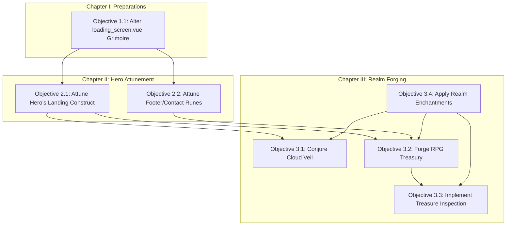

# Adventure Chronicle: The Quest for Fatih's RPG Domain

**The Grand Quest:** To reforge the personal domain (`fatihaziz.com`) into an RPG-inspired realm, drawing power from the GitHub Profile (`github.com/fatihaziz`), guided by the ancient `README.md` script, and to dispel the lingering temporal anomaly within the loading screen.

**Chronicle Scroll Location:** `/docs/plan.md`

---

## Chapter I: Banishing the Time Anomaly

*   **Mission:** Dispel the artificial time distortion affecting the loading screen construct.
*   **Prerequisites:** None.
*   **Objective 1.1: Alter the `components/loading_screen.vue` Grimoire**
    1.  **Consult Scroll:** `components/loading_screen.vue`.
    2.  **Find Incantation:** Locate the `onMounted` lifecycle spell (around line 18).
    3.  **Adjust Spell:** Within `onMounted`, remove the `setTimeout` enchantment binding `loading.value = false;`. The incantation should resemble:
        ```typescript
        onMounted(() => {
          // setTimeout(() => { // Dispel this line
            loading.value = false; // Unleash immediately
          // }, 1314); // Dispel this line
        });
        ```
        *Alternatively, should a fleeting moment of transition be desired for aesthetic resonance, replace `1314` with a minor value like `100`.*
    4.  **Verify Enchantment:** Confirm the loading screen vanishes swiftly or after the intended brief moment.

---

## Chapter II: Attunement of the Hero

*   **Mission:** Imbue the realm with the Hero's identity, drawing essence from the GitHub Profile (`https://github.com/fatihaziz`).
*   **Prerequisites:** Access to the rendering constructs (Hero, Footer, etc.). Benefits from Chapter I completion for clearer observation.
*   **Objective 2.1: Attune the Hero's Landing Construct**
    1.  **Identify Artifact:** Locate the Vue construct responsible for the main hero/landing area (likely `pages/index.vue` or an imported artifact).
    2.  **Gather Essences:** Extract vital energies from the GitHub Profile:
        *   Name: Fatih Al-Aziz
        *   Legend: "Code about AI, API, trade-bots, libs in Go, Rust, Python, and TS..."
        *   Known Haunts: Indonesia / Dubai, UAE
        *   Hero Portrait (Optional): If desired.
    3.  **Weave Information:** Replace placeholder runes and imagery within the hero construct with the gathered essences.
    4.  **Verify Attunement:** Visually inspect the hero construct for correct essence manifestation.
*   **Objective 2.2: Attune the Footer/Contact Runes**
    1.  **Identify Artifact:** Locate the Vue construct for the footer or contact sigils.
    2.  **Gather Essences:** Extract connection runes from the GitHub Profile:
        *   Personal Domain: `fatihaziz.com`
        *   Medium Scriptorium: `https://medium.com/@m.fatihalaziz`
        *   LinkedIn Guild Hall: `https://www.linkedin.com/in/fatih-aziz/`
        *   Aetheric Mailbox: `m.fatihalaziz@gmail.com` (from GitHub profile)
    3.  **Weave Information:** Add or update connection runes and contact sigils in the footer construct.
    4.  **Verify Attunement:** Test the connection runes and ensure sigils display correctly.

---

## Chapter III: Forging the RPG Realm

*   **Mission:** Reconstruct and re-theme the domain according to the RPG concept.
*   **Prerequisites:** Chapter II (for consistent identity/styling), potentially requires new artifacts (fonts, images).
*   **Objective 3.1: Conjure the Cloud Veil Transition**
    1.  **Gather Reagents:** Find or craft suitable layered, soft, Ghibli-style cloud graphics/SVG artifacts.
    2.  **Identify Location:** Determine the optimal placement for this veil (e.g., beneath the hero construct in `pages/index.vue` or its primary artifact).
    3.  **Scribe Incantation:** Weave the cloud artifacts using HTML/CSS spells. Style them to create a layered effect, separating the hero construct from the realm below. Implement subtle parallax scrolling enchantments for a dynamic essence.
    4.  **Verify Conjuration:** Ensure the veil appears aesthetically pleasing and functions across various viewing crystals (screen sizes).
*   **Objective 3.2: Forge the RPG-Themed Treasury (Portfolio)**
    1.  **Define Structure:** Map treasury categories to RPG concepts (e.g., "Workshop" -> Projects, "Skills Forge" -> Languages/Tools, "Guild Hall" -> Collaborations/Contributions).
    2.  **Design Blueprint:** Sketch or wireframe the treasury's layout, incorporating RPG elements like pixel-art icons for categories, thematic borders, and parchment-style backgrounds, drawing inspiration from the Dribbble artifact and chosen font runes.
    3.  **Forge Artifacts (Components):** Summon new Vue constructs:
        *   `RPGPortfolioSection.vue`: The main treasury chamber.
        *   `RPGPortfolioCategory.vue`: Construct for each category ("Workshop", etc.).
        *   `RPGPortfolioItem.vue`: Display case or scroll for individual treasures, implementing the "clickable shop item" interaction (likely via a modal pop-up for detailed inspection).
    4.  **Channel Data Streams:** Populate the treasury. Data streams may flow from:
        *   GitHub Pinned Repositories (requires GitHub API invocation or manual inscription).
        *   A local JSON codex or CMS.
    5.  **Verify Forging:** Scrutinize the layout, interactions, and data manifestation.
*   **Objective 3.3: Implement Treasure Inspection View**
    1.  **Design Blueprint:** Design the appearance of the detailed treasure view (e.g., a summoned modal inspection window, a separate chamber/route).
    2.  **Implementation:**
        *   **Modal:** Forge a `PortfolioDetailModal.vue` construct, summoned by interacting with an `RPGPortfolioItem`. Pass treasure details via props or a state management spell.
        *   **Route:** Establish a dynamic portal (e.g., `/portfolio/:slug`) within Nuxt. Create a chamber construct (`pages/portfolio/[slug].vue`) to fetch and display treasure details based on the portal's destination parameter.
    3.  **Data Handling:** Ensure the correct details manifest for the selected treasure.
    4.  **Verify Implementation:** Interact with various treasures and confirm the inspection view functions correctly.
*   **Objective 3.4: Apply Realm-Wide Enchantments (Theming & Fonts)**
    1.  **Bind Font Glyphs:**
        *   Acquire the desired font runes (e.g., from DaFont portal for "Spirited Away" style, Fontshare for Supreme).
        *   Configure the realm (e.g., via Nuxt config or CSS `@font-face` spells) to utilize these runes, specifically applying the 'Supreme' font rune for headings. Reference: `README.md` lines 5-9.
    2.  **Aesthetic Weaving:** Apply the overall visual enchantment consistently. Use a primary color magic (e.g., Sienna `#A0522D`, Beige `#F5F5DC`) and incorporate spacing/component styles inspired by the Dribbble artifact (`README.md` line 11). Employ CSS variables or a utility framework like Tailwind (if configured) for consistent enchantment.
    3.  **Verify Enchantment:** Visually survey the entire realm to ensure font and theme consistency.

---

## Adventure Path & Dependencies



*   **Chapter I** can commence independently.
*   **Chapter II** benefits from Chapter I completion for ease of observation. Objectives 2.1 and 2.2 are largely independent quests.
*   **Chapter III** is the core reforging:
    *   **Objective 3.4 (Enchantments)** should ideally begin early or be woven throughout Chapter III as it affects all visual artifacts.
    *   **Objective 3.1 (Cloud Veil)** requires knowledge of the hero construct (Objective 2.1) and the overall realm enchantment (Objective 3.4).
    *   **Objective 3.2 (Treasury)** depends on hero attunement (Chapter II) for consistent data/style and the realm enchantment (Objective 3.4).
    *   **Objective 3.3 (Inspection View)** directly requires the treasury (Objective 3.2) to be forged first.

---