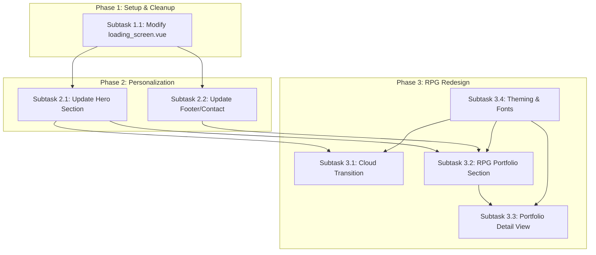

# Project Plan: Fatih Personal Website Redesign

**Project Goal:** Redesign the personal website based on the RPG concept outlined in `README.md`, personalize it using GitHub profile data, and remove the fixed loading screen delay.

**Plan Document:** `/docs/plan.md`

---

## Task 1: Remove Loading Screen Delay

*   **Goal:** Remove the artificial delay in the loading screen component.
*   **Dependencies:** None.
*   **Subtask 1.1: Modify `components/loading_screen.vue`**
    1.  **Open File:** `components/loading_screen.vue`.
    2.  **Locate Code:** Find the `onMounted` hook (around line 18).
    3.  **Modify Logic:** Inside `onMounted`, remove the `setTimeout` function wrapping `loading.value = false;`. The code should look like this:
        ```typescript
        onMounted(() => {
          // setTimeout(() => { // Remove this line
            loading.value = false;
          // }, 1314); // Remove this line
        });
        ```
        *Alternatively, if a very brief delay is desired for rendering purposes, replace `1314` with a small value like `100`.*
    4.  **Test:** Verify that the loading screen disappears almost immediately or after the desired minimal delay.

---

## Task 2: Personalize Website Content

*   **Goal:** Integrate personal information from the GitHub profile (`https://github.com/fatihaziz`) into the website.
*   **Dependencies:** Requires access to the components rendering the relevant sections (Hero, Footer, etc.). Likely depends on Task 1 being completed to easily view changes.
*   **Subtask 2.1: Update Hero Section**
    1.  **Identify Component:** Locate the Vue component responsible for rendering the main hero/landing section (likely `pages/index.vue` or a component it imports).
    2.  **Gather Data:** Extract relevant data from the GitHub profile:
        *   Name: Fatih Al-Aziz
        *   Bio: "Code about AI, API, trade-bots, libs in Go, Rust, Python, and TS..."
        *   Location: Indonesia / Dubai, UAE
        *   Maybe a profile picture if desired.
    3.  **Integrate Data:** Replace placeholder text and potentially images in the hero component with the gathered data.
    4.  **Test:** Check the hero section visually for correct content display.
*   **Subtask 2.2: Update Footer/Contact Section**
    1.  **Identify Component:** Locate the Vue component for the footer or contact area.
    2.  **Gather Data:** Extract contact/link data from the GitHub profile:
        *   Website: `fatihaziz.com`
        *   Medium: `https://medium.com/@m.fatihalaziz`
        *   LinkedIn: `https://www.linkedin.com/in/fatih-aziz/`
        *   Email: `m.fatihalaziz@gmail.com` (from GitHub profile)
    3.  **Integrate Data:** Add or update links and contact information in the footer component.
    4.  **Test:** Verify links work and information is displayed correctly.

---

## Task 3: Implement RPG Concept Redesign

*   **Goal:** Restructure and re-theme the website according to the RPG concept.
*   **Dependencies:** Task 2 (for consistent data/styling), potentially requires new assets (fonts, images).
*   **Subtask 3.1: Design & Implement Cloud Transition Layer**
    1.  **Asset Creation/Selection:** Find or create suitable cloud graphics/SVG that fit the aesthetic.
    2.  **Identify Location:** Determine where this transition fits best (e.g., bottom of the hero section in `pages/index.vue` or its main component).
    3.  **Implementation:** Add the cloud graphics using HTML/CSS. Style them to create a layered effect separating the hero section from the content below. Consider using CSS animations or parallax effects for a dynamic feel.
    4.  **Test:** Ensure the transition looks good and works across different screen sizes.
*   **Subtask 3.2: Create RPG-themed Portfolio Section**
    1.  **Define Structure:** Map portfolio categories to RPG concepts (e.g., "Workshop" -> Projects, "Skills Forge" -> Languages/Tools, "Guild Hall" -> Collaborations/Contributions).
    2.  **Design Layout:** Sketch or wireframe the section layout, incorporating RPG elements (icons, borders, backgrounds) inspired by the Dribbble reference and chosen fonts.
    3.  **Component Creation:** Build new Vue components:
        *   `RPGPortfolioSection.vue`: Main container for this area.
        *   `RPGPortfolioCategory.vue`: Component for each category ("Workshop", etc.).
        *   `RPGPortfolioItem.vue`: Card or list item for individual portfolio pieces, implementing the "clickable shop item" interaction.
    4.  **Data Integration:** Populate the section. Data could come from:
        *   GitHub Pinned Repositories (requires GitHub API fetch or manual entry).
        *   A local JSON file or CMS.
    5.  **Test:** Verify layout, interactions, and data display.
*   **Subtask 3.3: Implement Portfolio Item Detail View**
    1.  **Design:** Design how the detailed view of a portfolio item will look (e.g., a modal popup, a separate page/route).
    2.  **Implementation:**
        *   **Modal:** Create a `PortfolioDetailModal.vue` component triggered by clicking an `RPGPortfolioItem`. Pass data via props or a state management solution.
        *   **Route:** Set up a dynamic route (e.g., `/portfolio/:slug`) in Nuxt. Create a page component (`pages/portfolio/[slug].vue`) to fetch and display item details based on the route parameter.
    3.  **Data Handling:** Ensure the correct details are displayed for the selected item.
    4.  **Test:** Click various portfolio items and verify the detail view works correctly.
*   **Subtask 3.4: Apply Theming and Fonts**
    1.  **Font Integration:**
        *   Download/acquire the desired fonts (e.g., from DaFont link for "Spirited Away" style, Fontshare for Supreme).
        *   Configure the project (e.g., via Nuxt config or CSS `@font-face`) to use these fonts. Reference: `README.md` lines 5-9.
    2.  **Styling:** Apply the overall visual theme (colors, spacing, component styles) inspired by the Dribbble reference (`README.md` line 11) consistently across all components and pages. Use CSS variables or a utility framework like Tailwind (if configured) for consistency.
    3.  **Test:** Review the entire site visually to ensure font and theme consistency.

---

## Workflow & Dependencies:



*   **Task 1** can be done first independently.
*   **Task 2** depends on Task 1 only for ease of viewing changes. Subtasks 2.1 and 2.2 are mostly independent of each other.
*   **Task 3** is the core redesign:
    *   **Subtask 3.4 (Theming)** should ideally be started early or considered throughout Phase 3 as it affects all visual elements.
    *   **Subtask 3.1 (Cloud)** depends on knowing the hero section structure (Task 2.1) and the overall theme (Subtask 3.4).
    *   **Subtask 3.2 (Portfolio Section)** depends on personalization (Task 2) for consistent data/style and the theme (Subtask 3.4).
    *   **Subtask 3.3 (Detail View)** directly depends on the portfolio section (Subtask 3.2) being implemented.

---